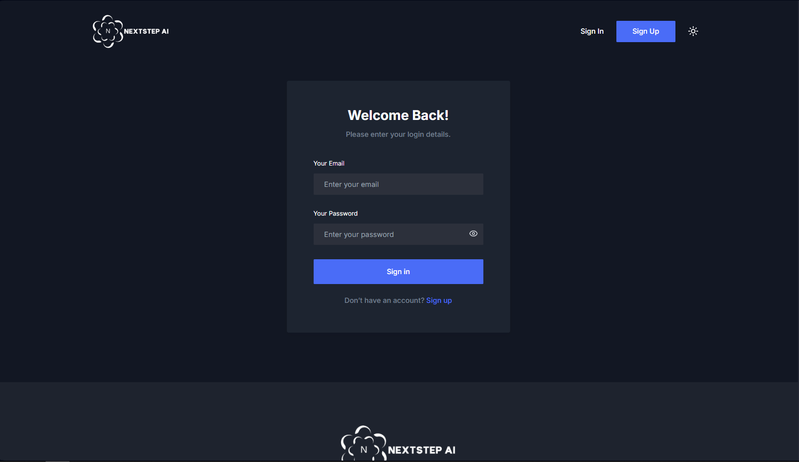
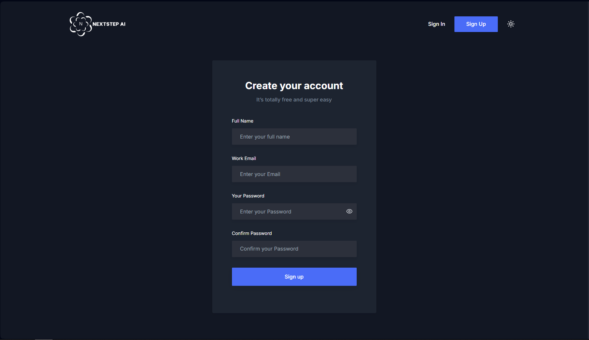
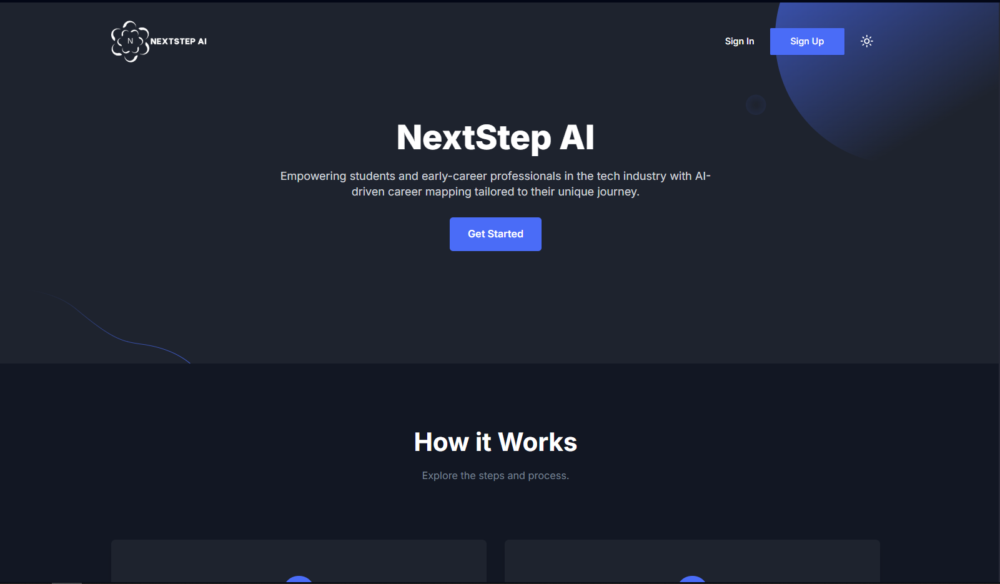
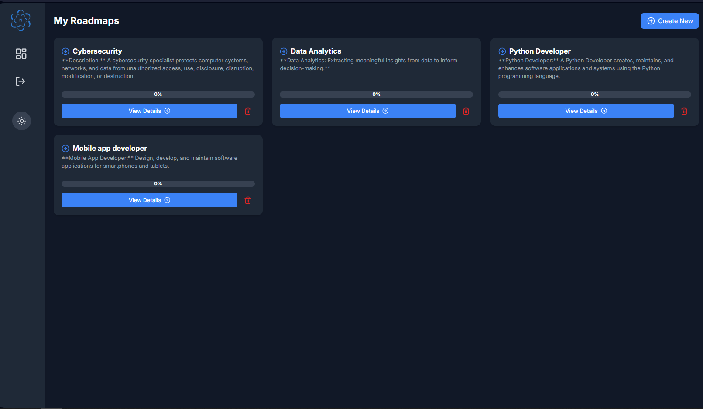
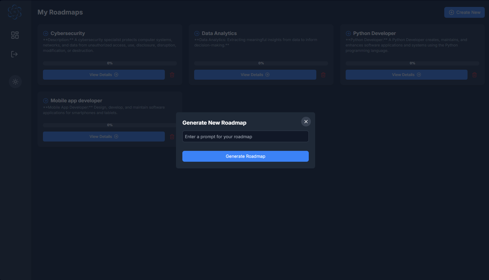
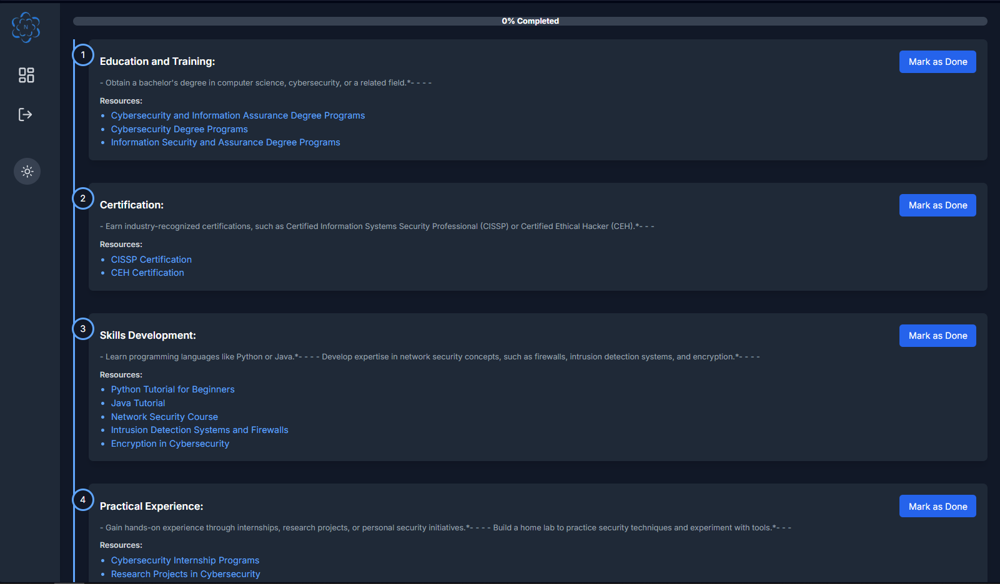

# NextSep AI - Personalized Career Pathways in the Tech Industry

## 🚀 Overview

NextSep AI is an AI-powered platform designed to help students and early-career professionals in the tech industry create personalized career roadmaps. By leveraging AI-driven insights, the platform identifies skill gaps, recommends learning resources, and provides a step-by-step guide to achieving career goals.

## ✨ Key Features

- **AI-Powered Career Roadmaps**: Personalized pathways based on user input and AI recommendations.
- **Curated Learning Resources**: Access to free and relevant materials for skill development.
- **Step-by-Step Guidance**: Structured mentorship for continuous career progression.
- **User-Friendly Dashboard**: Track progress and manage multiple roadmaps.
- **Secure Authentication**: Account registration and login for a personalized experience.

## 🏷️ Screenshots

### **1. Login Page**

_Secure user authentication with email and password login._

### **2. Register Page**

_User-friendly registration form for account creation._

### **3. Main Dashboard**

_Overview of user progress and quick access to career roadmaps._

### **4. User Dashboard**

_Manage saved roadmaps and access personalized recommendations._

### **5. Generate New Roadmap**

_Input desired career path and generate an AI-powered roadmap._

### **6. View Roadmap Details**

_Detailed step-by-step breakdown of the generated career roadmap._

## 🛠️ Tech Stack

### Frontend:

- Next.js (React Framework)
- Tailwind CSS for responsive design

### Backend:

- Firebase Firestore for database management
- AI Integration using Gemini AI API or GPT AI API

## 📌 System Modules

### 1. **User Management**

- Registration & Login (Authentication System)
- Secure user data management

### 2. **Career Roadmap Generator**

- User inputs desired career path (e.g., Web Developer, Data Scientist)
- AI generates a step-by-step learning roadmap
- Provides curated resources (videos, articles, courses)

### 3. **Roadmap History & Management**

- Save and manage previously generated roadmaps
- View, edit, or delete saved roadmaps

### 4. **Actual Roadmap View**

- Displays roadmap in an organized format
- Direct access to learning resources

## 🖥️ System Requirements

### **Hardware Requirements:**

- **Desktop/Laptop:** Intel Core i5/i7 or AMD Ryzen 5/7, 8GB RAM (16GB recommended), 256GB SSD (512GB recommended).
- **Devices for Testing:** Android & iOS smartphones/tablets.
- **Network:** High-speed internet (Wi-Fi 6 preferred).
- **Monitor:** Full HD or higher resolution.

### **Software Requirements:**

- **Development Tools:** Visual Studio Code (React, Tailwind CSS, JSON, Git).
- **UI/UX Design:** Figma, Adobe XD, Canva.
- **Testing Tools:** Postman (API testing).
- **Supported Browsers:** Google Chrome, Firefox, Safari.
- **Version Control:** GitHub or GitLab.

## 🔍 Data Structure & Models

### **User Data**

| Field      | Description                        |
| ---------- | ---------------------------------- |
| user_id    | Unique identifier (auto-generated) |
| username   | Chosen username                    |
| email      | User’s email address               |
| password   | Encrypted password                 |
| created_at | Account creation timestamp         |

### **Generated Roadmaps**

| Field       | Description                                           |
| ----------- | ----------------------------------------------------- |
| roadmap_id  | Unique identifier for each roadmap                    |
| user_id     | Links to the user who generated it                    |
| career_path | Selected career path (e.g., Web Developer)            |
| steps       | List of learning steps with titles and resource links |
| created_at  | Timestamp of roadmap generation                       |

### **Learning Resources**

| Field       | Description                                |
| ----------- | ------------------------------------------ |
| resource_id | Unique identifier                          |
| title       | Name of the resource (e.g., HTML Tutorial) |
| platform    | Source (YouTube, Coursera, etc.)           |
| type        | Video, Documentation, etc.                 |
| link        | URL to the resource                        |

## 📌 Architectural Design

- **User Input & Processing:** Users select their career goals → System validates input → Data sent to AI model.
- **AI-Powered Recommendation:** Gemini AI/GPT API generates roadmap based on industry trends.
- **Personalized Roadmap Display:** Roadmap is formatted and displayed on the user's dashboard.

## 📩 Deployment

---

Developed by **Code Side Mafia**

- John Andrew Borabo
- Kimberly Dela Cruz
- Ernesto Lareza
- Shyrish Hance Pumanes
